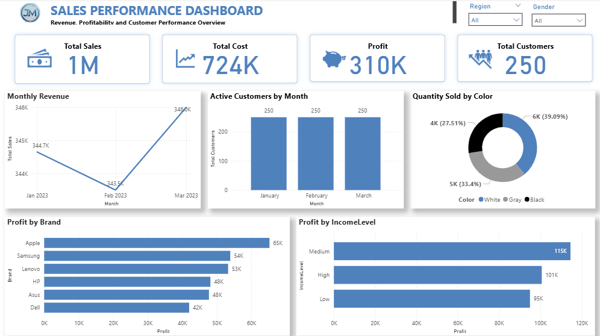

# Power BI sales performance dashboard

**Type:** Training project · Power BI dashboard  
**Context:** TS Academy data analytics training, with guidance from Ezekiel Aleke.  
**Files:** [Open the Power BI file](Joel_Mokolo_Power_BI_Project.pbix) · [View the dashboard image](Joel_Mokolo_Power_BI_Project.png)

## What the dashboard shows

I built a single-page report covering total sales, cost, profit and customers. The report compares monthly sales and customer activity, profit by brand and income level, and quantity by product colour. Region and gender slicers let the viewer change the perspective. The `.pbix` is provided so the visuals, model and measures can be inspected in Power BI Desktop.

## How to inspect it

Open `Joel_Mokolo_Power_BI_Project.pbix` in Power BI Desktop and visit the `Dashboard` page. Test the region and gender slicers; then inspect the fields and measures behind the KPI cards and charts. The screenshot is a static reference.

## Scope and limitations

This is a training project, not an operational business report. Its displayed figures are for the data and filters inside this Power BI file. It is separate from the Excel sales dashboard, so their numbers should not be assumed to match. Data provenance beyond the training context was not included with the uploaded file.
